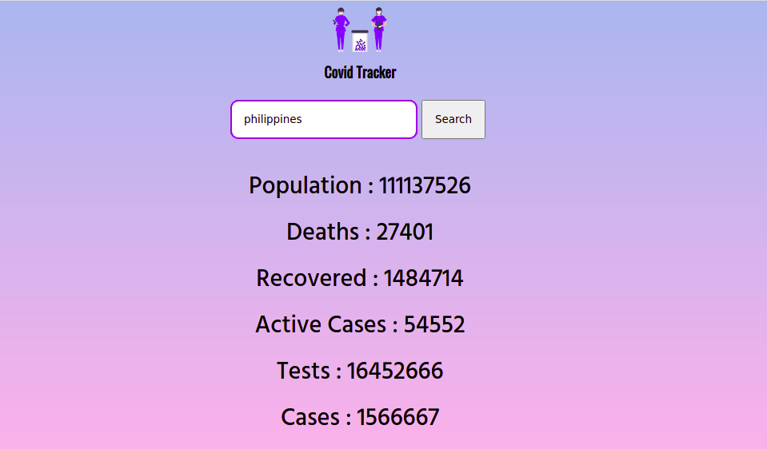

# Covid Tracker

    It is a single page application made using React.

# What it does ?

    It show the covid statistics for a particular country as we enter it. 
    Covid Data like - Population , Deaths , Recovered , Active Cases , Tests , Total Cases

# How it does this ?

    It interacts with covid19 api with the backend every time we enter the country name and search it and nicely display the data on the ui.

# What it looks ?

## App url

    https://luv8436.github.io/Covidtracker/
